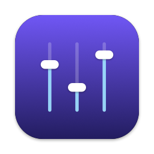
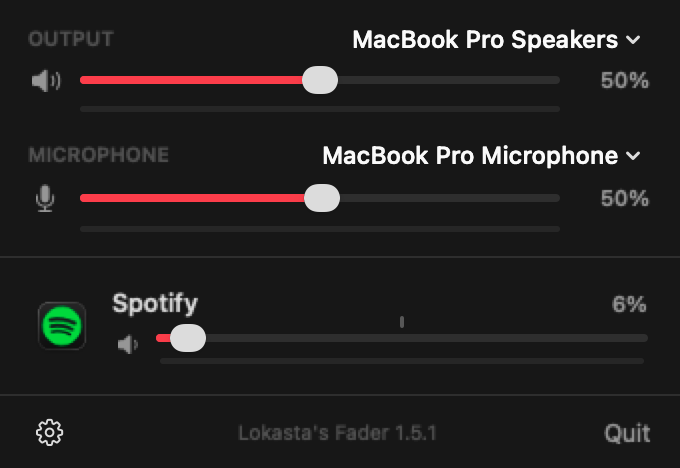

<p align="center">
  
</p>

<h1 align="center">Lokasta's Fader</h1>

<p align="center">
  Per-app volume for macOS, from the menu bar or Control Center.<br>
  No drivers, no BlackHole, no virtual devices. Free and open source.
</p>

<p align="center">
  <a href="https://github.com/Lokasta/fader/actions/workflows/ci.yml"></a>
</p>

<p align="center">
  
</p>

## Why

macOS has one volume slider for everything. Turning Discord down means turning your game down too. The usual fixes install a virtual audio driver and ask you to rewire your output, and when something goes wrong your sound just stops.

Fader uses the **Core Audio Process Taps** Apple added in macOS 14.2. It only touches the apps you change, installs nothing in the system, and if it quits, every app's audio goes back to normal instantly.

## Features

- **Volume per app, 0 to 200%**, with mute. A soft limiter keeps boosted audio from clipping.
- **Live level meters** for every app, the output and the microphone.
- **Remembers** each app's volume and reapplies it the next time the app plays.
- **Output and microphone switcher** with their system volume, right at the top.
- **Real app names**: Chrome's audio service shows up as Chrome, Safari's WebKit process as Safari, macOS alerts as "System Sounds".
- **Open it your way**: menu bar icon, a **Control Center control** (macOS 26), the **Dictation key (F5)**, **⌃⌥V** from anywhere, or Spotlight.
- **Light**: ~0.5% CPU at idle. Meters run only while the panel is open.
- **Private**: no network access at all. See [SECURITY.md](SECURITY.md).
- English and Brazilian Portuguese.

## Install

<p align="center">
  <a href="https://github.com/Lokasta/fader/releases/latest/download/LokastasFader.dmg"><b>⬇ Download Lokasta's Fader for macOS</b></a>
  &nbsp;·&nbsp;
  <a href="https://lokasta.github.io/fader/">Website</a>
  &nbsp;·&nbsp;
  <a href="https://github.com/Lokasta/fader/releases">All releases</a>
</p>

1. Download **LokastasFader.dmg** (link above, always the latest version). Requires macOS 15 or later.
2. Open it and drag **Fader** into **Applications**.
3. Open Fader from Applications or Spotlight. It lives in the menu bar (no Dock icon) and starts at login.
4. Allow **System Audio Recording** when macOS asks (System Settings > Privacy & Security > Screen & System Audio Recording, if you missed the prompt).

The app is signed with a Developer ID and notarized by Apple, so it opens without warnings. Updating: download the new DMG and replace the app; your volumes and settings are kept.

**Uninstall:** quit Fader (gear > Quit), drag it from Applications to the Trash. Optionally remove its settings with `defaults delete com.lokasta.fader`.

**Build from source** (Xcode 26+):

```bash
brew install xcodegen
git clone https://github.com/Lokasta/fader && cd fader
./scripts/install.sh
```

Source builds are ad-hoc signed, so macOS asks for permissions again after each rebuild. To sign with your own certificate, see `Config/Signing.xcconfig`.

**Or ask your coding agent.** The repo ships an [AGENTS.md](AGENTS.md) written for Claude Code, Codex, Cursor and friends: clone it and say *"build and install Fader"*, or *"add a keyboard shortcut to mute Spotify"*. It has the architecture, the rules that keep audio safe, and how to verify changes without ears.

## First run

1. macOS asks for **System Audio Recording**: that's how Fader reads each app's audio. Nothing is recorded.
2. Opening the panel asks for the **Microphone**, only for the mic level meter. Deny it and everything else still works.
3. To put Fader in Control Center: Control Center > **Edit Controls** > search **Fader** > drag it in (or to the menu bar).

Crowded menu bar? On notched MacBooks, icons that don't fit are hidden silently. Use F5, ⌃⌥V or Spotlight, or pin the icon next to the clock:

```bash
pkill -x Fader; defaults write com.lokasta.fader "NSStatusItem Preferred Position Item-0" -float 330; open -a Fader
```

## How it works

For an app you turn down (or up):

1. A **process tap** captures the app's processes and, with `mutedWhenTapped`, keeps them from reaching the speakers directly.
2. A private **aggregate device** pairs that tap with your current output.
3. A real-time **IO proc** copies the samples to the output with your gain, ramped per buffer so changes never click.

Apps at 100% skip all of this. While the panel is open, their meters come from unmuted taps that share a single aggregate device, so 20 playing apps cost one audio thread, not twenty.

The microphone is never captured by the volume engine. The mic meter reads it only while the panel is open, and never on Bluetooth microphones, which would switch your headphones to call quality.

## Development

```bash
xcodegen generate                                                   # project from project.yml
xcodebuild -project Fader.xcodeproj -scheme Fader -derivedDataPath build test
build/Build/Products/Debug/Fader.app/Contents/MacOS/Fader --snapshot panel.png   # render the panel
/usr/bin/log show --last 5m --predicate 'subsystem == "com.lokasta.fader"' --info  # logs
./scripts/release.sh                                                # signed + notarized DMG
```

Contributions are welcome. Read [AGENTS.md](AGENTS.md) first (yes, humans too), keep the IO path real-time safe, and add a [CHANGELOG](CHANGELOG.md) entry.

## Contributing

Bug reports, ideas and pull requests are welcome. [CONTRIBUTING.md](CONTRIBUTING.md) has the setup, the PR checklist and how to verify audio changes; CI builds and tests every pull request.

## License

[MIT](LICENSE) © 2026 Lokasta
